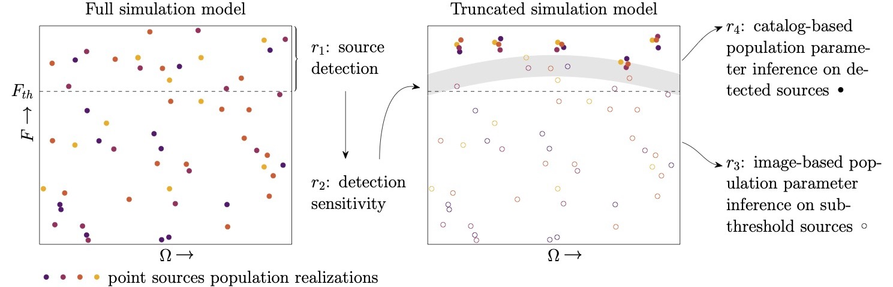

# Detection is truncation: studying source populations with truncated marginal neural ratio estimation

Code repository for [Anau Montel and Weniger (2022)](https://arxiv.org/abs/2211.04291).

[](https://opensource.org/licenses/MIT)
[](https://arxiv.org/abs/2211.04291)




## Notes

Runs with [swyft](https://github.com/undark-lab/swyft/tree/lightning) commit 73c78fbf110b19c7ee21f4446913c7386bf38c42 on lightning branch.


## References

If you use this code, please cite our paper:

```
@article{anaumontel2022detection,
  title={Detection is truncation: studying source populations with truncated marginal neural ratio estimation},
  author={Anau Montel, Noemi and Weniger, Christoph},
  journal={arXiv preprint arXiv:2211.04291},
  year={2022}
}
```
and [swyft](https://github.com/undark-lab/swyft)
